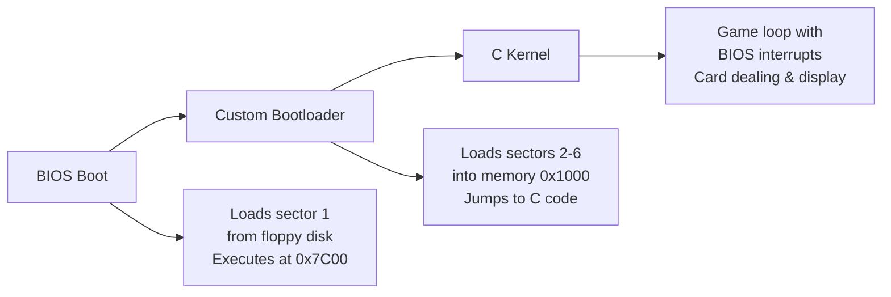
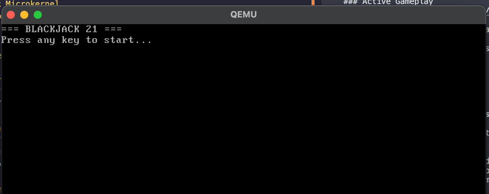
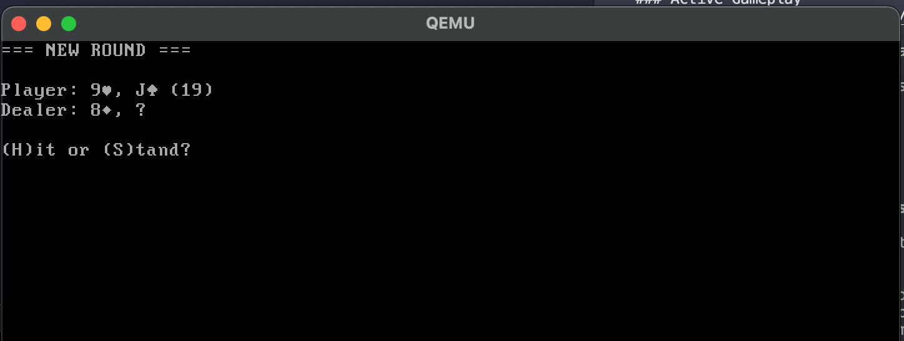
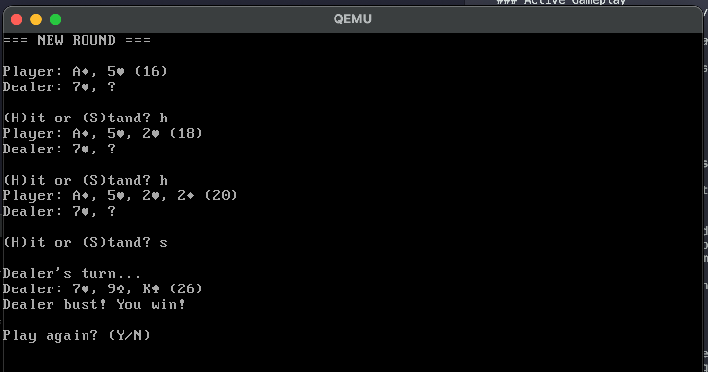
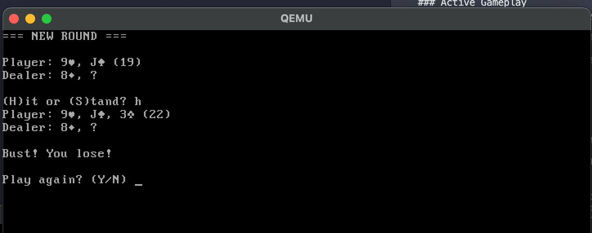
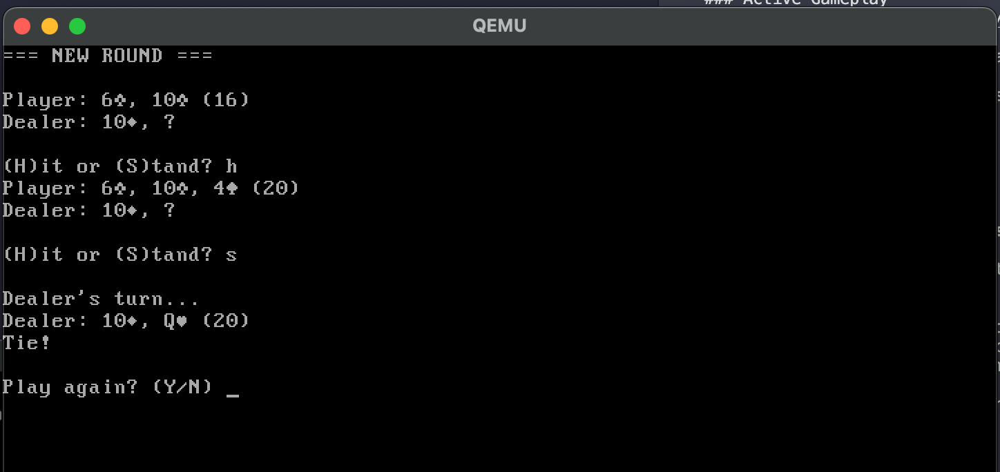
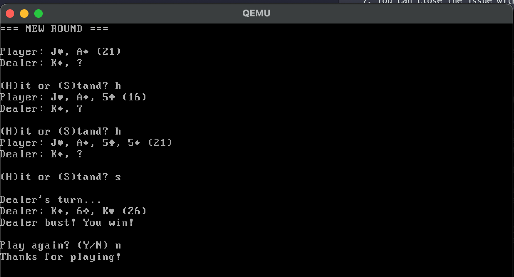

# Blackjack Microkernel

<div align="center">

[](https://www.nasm.us/)
[](https://gcc.gnu.org/)
[](https://en.wikipedia.org/wiki/IA-32)
[](https://wiki.osdev.org/Bootloader)
[](https://www.gnu.org/software/make/)

</div>

## Overview

A minimalist x86 microkernel that boots from floppy disk and runs an interactive Blackjack casino game entirely in bare-metal environment. This project explores low-level systems programming by implementing a complete gaming experience without relying on any operating system infrastructure or standard libraries.

### What Makes This Special

- **Zero Dependencies**: Runs directly on hardware with only BIOS support
- **Hand-Crafted Boot Process**: Custom 512-byte bootloader written in assembly
- **Cross-Architecture Build**: Developed on modern ARM Macs, runs on legacy x86

### Implementation Strategy

- **Two-Stage Loading**: BIOS → Custom bootloader → C kernel execution
- **Hardware-Direct I/O**: Keyboard input and screen output via BIOS interrupts
- **Smart Memory Layout**: Careful placement using custom linker scripts
- **Embedded Game Logic**: Complete card game fits in minimal memory footprint

## Features

### Game Features
- **Complete Blackjack Rules**: Hit, Stand, Bust, Dealer AI (hits until 17+)
- **Real Card Deck**: 52 unique cards with suits (♣♥♦♠) using extended ASCII
- **No Duplicate Cards**: Fisher-Yates shuffle ensures no card repeats in a game
- **Proper Ace Handling**: Aces count as 1 or 11 automatically
- **Face Cards**: Jack, Queen, King displayed as J, Q, K (all worth 10)
- **Random Dealing**: Pseudo-random number generator seeded by user keypress

### System Features
- **Direct Hardware I/O**: BIOS interrupt-based keyboard and display
- **Real-time Input**: Immediate response to keyboard presses
- **VGA Text Mode**: 80x25 character display with extended ASCII support
- **Memory Management**: Custom linker script with proper section layout
- **Error Handling**: Disk read error detection and reporting

## Architecture

### Boot Process Flow



## Building and Running

### Prerequisites

**Required Tools:**
- NASM (x86 assembler)
- i686-elf-gcc (Cross-compiler for C)
- i686-elf-ld (Cross-linker)
- i686-elf-objcopy (Binary utilities)
- QEMU (qemu-system-i386 emulator)

**Installation on macOS:**
```bash
# Install cross-compilation toolchain
brew install i686-elf-gcc i686-elf-binutils

# Install NASM and QEMU
brew install nasm qemu
```

### Build Commands

| Command | Description | Output |
|---------|-------------|--------|
| `make run` | Full build → Floppy image → Run in QEMU | Game execution in QEMU |
| `make all` | Build all components | `bootloader.bin`, `kernel.bin`, `disk.img` |
| `make clean` | Clean all artifacts | Removes all build files |

### Quick Start

```bash
git clone <repository-url>
cd m7-microkernel
make run
```

## 📁 Project Structure

```
m7-microkernel/
├── bootloader.s           # Assembly bootloader source
├── kernel_entry.s         # Kernel entry point (ASM→C bridge)
├── kernel.c               # C kernel with Blackjack game
├── kernel.ld              # Custom linker script
├── Makefile               # Build system configuration
├── .gitignore             # Git ignore patterns
└── README.md              # This documentation

Generated Files (ignored by git):
├── bootloader.bin         # Assembled bootloader (512 bytes)
├── kernel_entry.o         # Entry point object file
├── kernel.o               # C kernel object file
├── kernel.bin             # Final kernel binary
├── kernel.tmp             # Temporary linked file
└── disk.img               # Bootable floppy disk image (1.44MB)
```

## 📸 Demonstration

### Game Welcome Screen

*Game title screen with instructions to start playing*

### New Round Setup

*Fresh round showing initial card dealing with suits displayed*

### Game Victory

*Player wins with optimal hand against dealer*

### Game Loss

*Dealer wins scenario showing final card totals*

### Tie Game

*Equal hands resulting in a tie/push*

### Game Exit

*Graceful exit message when player chooses to quit*

## Implementation Details

### BIOS Interrupt Usage

```c
// Character output via BIOS INT 10h
void print_char(char c) {
    asm volatile (
        "mov $0x0e, %%ah\n"    // BIOS teletype function
        "mov %0, %%al\n"       // Character to print
        "int $0x10"            // Call BIOS interrupt
        :
        : "r" (c)              // Input: character
        : "ah", "al"           // Clobbered registers
    );
}

// Keyboard input via BIOS INT 16h
char read_key() {
    char key;
    asm volatile (
        "mov $0x00, %%ah\n"    // BIOS keyboard read function
        "int $0x16\n"          // Call BIOS interrupt
        "mov %%al, %0"         // Store result
        : "=r" (key)           // Output: key pressed
        :
        : "ah", "al"           // Clobbered registers
    );
    return key;
}
```

### Card System Implementation

```c
// Card format: [4-bit suit][4-bit value]
// Suits: 0=♣, 1=♥, 2=♦, 3=♠
// Values: 1=A, 2-10=face, 11=J, 12=Q, 13=K

// Fisher-Yates shuffle
void shuffle_deck() {
    for (int i = 0; i < 52; i++) {
        shuffled_deck[i] = deck[i];
    }

    for (int i = 51; i > 0; i--) {
        int j = random() % (i + 1);
        int temp = shuffled_deck[i];
        shuffled_deck[i] = shuffled_deck[j];
        shuffled_deck[j] = temp;
    }
    deck_position = 0;
}
```

## Game Mechanics

### Blackjack Rules
- **Aces**: Count as 1 or 11 (automatically optimized for best hand)
- **Face cards (J, Q, K)**: All worth 10 points
- **Number cards**: Face value (2-10)
- **Bust**: Hand total over 21
- **Dealer**: Must hit until reaching 17 or higher

### Controls
- Any key: Start game
- H/h: Hit (take another card)
- S/s: Stand (keep current hand)
- Y/y: Play again after round
- N/n: Exit game
